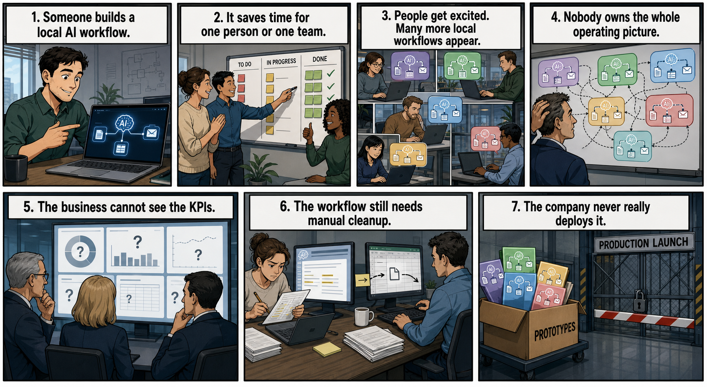

# The Demo Is Not the Product. The Workflow Is the Product.

**SEO title:** The Demo Is Not the Product. The Workflow Is the Product.  
**Description:** Why AI demos stall before production, and how teams turn useful prototypes into deployed workflows with context, memory, orchestration, and measurable business value.  
**Canonical slug:** `/challenges/demo-is-not-the-product-workflow-is-the-product`  
**Reader/job:** AI architects, CTOs, product leaders, and founders trying to move an impressive AI demo into a real deployed workflow.

**Takeaway:** A demo answers a prompt. A product completes a workflow.

That difference sounds small until you try to deploy AI inside a real company.

A demo can summarize a support ticket, draft a sales email, research a prospect, or answer questions from a document. Useful? Yes. Valuable? Sometimes.

But a workflow has more gravity.

It has triggers, permissions, systems of record, missing context, human approvals, retries, duplicate detection, audit trails, cost limits, and consequences when it gets something wrong.

That is where many AI projects **stall** or fail to account for the full **360 degree** complexity of production-ready workflows.

This article is about the first real challenge in AI-native adoption: the full components needed to move from impressive individual workflows to production workflows the business can trust, observe, scale, and measure.

## The Signal

The pattern is showing up everywhere. You've seen it, you've read it.

McKinsey's 2025 AI survey found that 88% of respondents report regular AI use in at least one business function, but only about one-third say their companies have begun scaling AI across the enterprise. McKinsey also found that high performers are far more likely to redesign workflows, not just deploy tools. ([McKinsey, 2025](https://www.mckinsey.com/capabilities/quantumblack/our-insights/the-state-of-ai))

Deloitte's 2026 State of AI in the Enterprise survey found that only 25% of respondents had moved 40% or more of their AI pilots into production. The same survey found that only 30% of organizations were redesigning key processes around AI. ([Deloitte, 2026](https://www.deloitte.com/us/en/about/press-room/state-of-ai-report-2026.html))

MIT NANDA's 2025 GenAI Divide report made the point even more directly: only 5% of custom enterprise AI tools reached production in its research, and tools often failed because they lacked memory, adaptation, and workflow integration. ([MIT NANDA / MLQ, 2025](https://mlq.ai/media/quarterly_decks/v0.1_State_of_AI_in_Business_2025_Report.pdf))

Gartner predicted that over 40% of agentic AI projects will be canceled by the end of 2027 because of escalating costs, unclear business value, or inadequate risk controls. Gartner also warned that many agent projects are still early experiments or proofs of concept, not production systems. ([Gartner, 2025](https://www.gartner.com/en/newsroom/press-releases/2025-06-25-gartner-predicts-over-40-percent-of-agentic-ai-projects-will-be-canceled-by-end-of-2027))

The lesson is not that AI does not work.

The lesson is that AI does not become valuable just because someone built a clever demo.

## The Demo Trap

The demo trap usually looks like this:

- Someone builds a local AI workflow.
- It saves time for one person or one team.
- People get excited. Many more local workflows appear.
- Nobody owns the whole operating picture.
- The business cannot see the KPIs.
- The workflow still needs manual cleanup.
- The company never really deploys it.

It is the normal early stage, _not_ a sign of failure.

The problem starts when leadership **mistakes** local productivity for organizational transformation - and fail to plan effective to the next step: production workflow.

- Which workflow advances?
- What systems do we need?
- What context does it need?
- Who owns it?
- How do you measure it?
- How do you govern it?

If the output still has to be copied, checked, routed, explained, and manually entered into another system, you probably did not automate a workflow. You created a better workbench for one person.

That may be worth doing. But it is not yet the product.

## What a Workflow Actually Requires

A production AI workflow needs to answer boring questions clearly.

What starts the workflow?

Is it a webhook, a scheduled job, a customer action, a sales event, a ticket change, a CRM update, a Slack message, or a human request?

What systems does it touch?

Is it reading from Salesforce, GitHub, Linear, Zendesk, HubSpot, product telemetry, cloud logs, internal docs, meeting notes, or billing data?

What context does it need?

Does it know the customer, contract terms, account history, previous objections, product usage, open support issues, internal policy, and what happened last time?

What happens when it is uncertain?

Does it ask a human, stop, retry, escalate, or make a bounded recommendation?

What is the audit trail?

Can someone later see what data was used, which tools were called, which prompt or model version ran, what the agent decided, and who approved the action?

That is the shape of a product.

Not the chat window.

## Context Is Not Decoration

Many weak AI workflows fail because they treat context as optional _OR_ narrow singleton attributes.

Generic AI can write a decent email. But an operational AI workflow needs to know who the email is for, what the customer cares about, what happened in the last conversation, which objections have already been handled, which features are relevant, and which claims the company should avoid making.

The same applies to support, field engineering, onboarding, renewals, finance, security, and product operations.

Without context, AI becomes fluent but **shallow** - and **trust** decays.

But context is hard because it lives everywhere and needs to be governed:

- CRM records
- call notes
- Slack threads
- product telemetry
- support tickets
- GitHub issues
- docs
- email
- spreadsheets
- memory in people's heads

RAG alone **does not** solve this.

Retrieval finds information. A workflow needs operational memory: what changed, what was approved, what failed, what the customer prefers, which facts are current, and what the next best action should be.

That is a different design problem.

## A Personal Example

I have seen this shift up close.

At our company, many employees built local AI workflows. They used AI to interact with clients, polish outbound messages, research accounts, and automate small pieces of their day.

The work was useful at the individual level. People were faster. Messages improved. Research got easier.

But the company did not have a cohesive system.

There was limited visibility. Limited KPI tracking. Limited direction. Many workflows still required manual handoffs. The value was real, but it was fragmented.

The step change happened when we hired an **AI-growth engineer** and treated the work as production workflow design, not personal productivity.

We moved from local workflows to orchestrated workflows: webhook-triggered, scheduled, observable, and connected to real systems.

We automated deep AI-driven research. We found and enriched users across LinkedIn, Reddit, GitHub, and other channels. We used AI to create higher-quality outbound reach at scale, not by spamming people, but by improving relevance and timing. And by patiently building a rapport with the prospect over time.

We also turned meeting notes into follow-up workflows. Instead of notes dying in a document, they became inputs for agents that helped prepare the next client call, surfaced competitive context, and showed our field engineering team where product blind spots were appearing.

That was the difference.

The local workflows were helpful. The production workflows created **operating leverage** with **measurable** business impact.

## Deployment Is Still Hard

The toolset is improving, but deploying AI agents is still not as clean as deploying a normal web service.

A serious agent needs more than a prompt and a model key.

It needs:

- secure tool access
- identity and permissions
- memory
- state
- retries
- scheduling
- observability
- evals
- secrets management
- cost monitoring
- versioning
- rollback
- human approval paths

Cloud platforms are catching up. AWS has Bedrock AgentCore for deploying and operating agents with runtime, memory, identity, gateway, browser, code interpreter, and observability components. ([AWS](https://aws.amazon.com/blogs/aws/introducing-amazon-bedrock-agentcore-securely-deploy-and-operate-ai-agents-at-any-scale/))

Microsoft has Foundry Agent Service for building and deploying agents with managed identity, connected tools, and enterprise integration. ([Microsoft](https://learn.microsoft.com/en-us/azure/foundry/agents/overview))

Google has Gemini Enterprise Agent Platform for building, sharing, deploying, and scaling agents across organizations. ([Google Cloud](https://docs.cloud.google.com/gemini-enterprise-agent-platform/scale))

Outside the cloud suites, frameworks like LangGraph are becoming important for agent orchestration, state, and controllable multi-step behavior. ([LangGraph](https://www.langchain.com/langgraph))

And durable execution platforms like Temporal matter because many AI workflows are not one-shot requests. They need long-running processes, retries, timers, external events, and recovery from failure. ([Temporal](https://docs.temporal.io/))

These are not interchangeable tools. They are signs of where the market is going.

The winners are likely to be the tools that make agents boring enough to operate: observable, permissioned, recoverable, measurable, and integrated into the systems where work already happens.

## The Workflow Readiness Map

Before building an AI agent, map the workflow.

Use this checklist:

1. What event starts the workflow?
2. What business metric should improve?
3. Which systems does the workflow read from?
4. Which systems does it write to?
5. What context does the agent need?
6. What memory should persist across runs?
7. What permissions constrain data and action?
8. What should be deterministic code instead of AI judgment?
9. When should a human approve or override?
10. What happens on failure, timeout, or uncertainty?
11. How will you observe cost, quality, latency, and outcomes?
12. Who owns the workflow after launch?

If you cannot answer these questions, do not start with the agent.

Start with the workflow.

## The Point

AI adoption does not become serious when people use more AI tools.

It becomes serious when the company redesigns work around AI and can still explain, measure, govern, and improve the result.

The demo matters because it creates belief.

But belief is not enough.

The workflow is where the value lives.

And the workflow is the product.

---

**Related reading:**

- [AI Adoption Starts With Fear](./the_fear.md)
- [Moving Forward With AI](./02_moving_forward.md)
